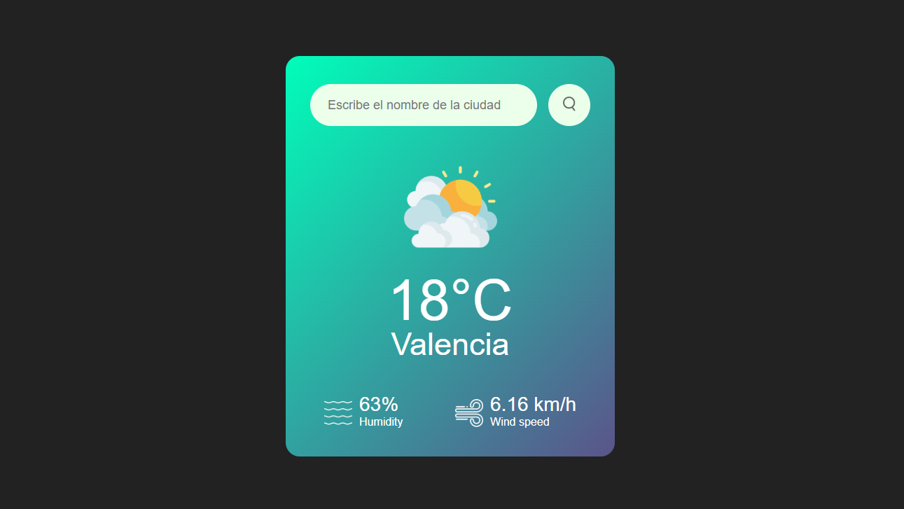

# MeteoTrack

MeteoTrack es una pequeña aplicación de clima moderna y minimalista que utiliza la API de OpenWeather para proporcionar datos meteorológicos en tiempo real de cualquier ciudad del mundo.

<center>

🔗 **[Ver Demo en Vivo en Vercel](https://meteo-track-hazel.vercel.app/)** 🔗



</center>


## Características

- 🔍 **Búsqueda instantánea:** Consulta el clima de cualquier ciudad.
- ⌨️ **UX Mejorada:** Búsqueda activa mediante la tecla `Enter`.
- 📊 **Datos detallados:** Temperatura, humedad y velocidad del viento.
- 🎨 **Interfaz Dinámica:** Los iconos cambian según el estado del cielo.
- 🔐 **Seguridad:** Uso de variables de entorno con Vite para proteger credenciales.

## Guía: Cómo obtener tu propia API Key

Para que esta aplicación funcione con tus propios datos, necesitas una clave gratuita de **OpenWeatherMap**:

1.  Ve a [OpenWeatherMap.org](https://openweathermap.org/api) y crea una cuenta gratuita.
2.  Una vez registrado, accede a tu panel de control en la sección **"My API Keys"**.
3.  Genera una nueva clave dándole un nombre (ej. "MeteoTrack").
4.  **Espera entre 10 y 30 minutos** a que la clave se active (OpenWeather tarda un poco en propagarla).
5.  Copia la clave y pégala en tu archivo `.env` local o en las variables de entorno de Vercel.

## Tecnologías utilizadas

- **HTML5 & CSS3** (Flexbox & Glassmorphism).
- **JavaScript (ES6+)** (Fetch API & Async/Await).
- **[Vite](https://vitejs.dev/)** - Frontend Tooling.
- **Vercel** - Hosting y CD/CI.

## Instalación Local

1. **Clona el repositorio:**
```
git clone https://github.com/samonzfu/MeteoTrack
cd MeteoTrack
npm install
npm run dev
```

---
